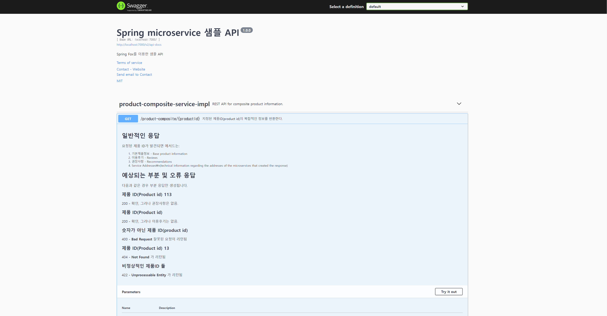

## Enviroment
* JDK 1.8
* Spring Fox
## Coding Style Guide
* [Google Java Style Guide](https://google.github.io/styleguide/javaguide.html) 적용
* Intellij IDEA 의 [`google-java-format`](https://plugins.jetbrains.com/plugin/8527-google-java-format) 플러그인 설치 및 적용

## Docker
도커 설정은 각 마이크로서비스 별로 존재
```shell
docker-compose up -d
```

## Spring Fox 를 이용한 API 문서
* $HOST:$PORT/swagger-ui/ 로 접속
